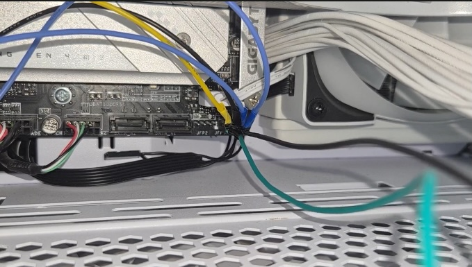

# Demonstration

# Prerequisites

## Parts list

The parts list will include everything needed if you 3D print the case. 

| Item                               | Configuration                      | Cost per unit | Units needed | Link                                                                                                                                      | Comment                                                                                                                                                                                                                                                                  |
|------------------------------------|------------------------------------|---------------|--------------|-------------------------------------------------------------------------------------------------------------------------------------------|--------------------------------------------------------------------------------------------------------------------------------------------------------------------------------------------------------------------------------------------------------------------------|
| Square LED Button                  | 3-6V \| 1NO 1NC 5PCS \| Self reset | 1.08€         | 1            | [Link](https://de.aliexpress.com/item/1005005791728074.html?spm=a2g0o.order_list.order_list_main.370.70c15c5fWvf0GJ&gatewayAdapt=glo2deu) | You can freely choose the color.                                                                                                                                                                                                                                         |
| ON-ON toggle Switch                | -                                  | 0.25€         | 2            | [Link](https://de.aliexpress.com/item/32809087410.html?spm=a2g0o.order_list.order_list_main.303.70c15c5fWvf0GJ&gatewayAdapt=glo2deu)      | It would make more sense to use ON-OFF switches but since the pictures will all have ON-ON switches I linked those.                                                                                                                                                      |
| LEDs                               | 3-6V \| 8mm                                    | 0.70€             | 2            | [Link](https://de.aliexpress.com/item/1005006195467115.html)                                                                                                                                         | -                                                                                                                                                                                                      |
| USB-C trigger board                               |-                                    | 1.29€             | 1            | [Link](https://de.aliexpress.com/item/1005005622939899.html)                                                                                                                                         | -                                                                                                                                                                                                      |
| Missile launch square button cover                               | -                                  |   0.36€           | 1            | [Link](https://de.aliexpress.com/item/1005004587725359.html)                                                                                                                                         | This is optional.                                                                                                                                                                                                      |
| Key switch                               | -                                  | 1.39€             | 1            | [Link](https://de.aliexpress.com/item/1005007639829271.html)                                                                                                                                         | I couldn't find the exact one but this one should fit aswell.                                                                                                                                                                                                      |
| Heated inserts (M3xL3xD3.5)        | M2M2.5M3M4M5(650pcs)               | -             | 4            | [Link](https://de.aliexpress.com/item/1005005511594304.html?spm=a2g0o.order_list.order_list_main.406.70c15c5fWvf0GJ&gatewayAdapt=glo2deu) | Heated inserts are needed so you have threads you can screw into, alternatively the diameter of the holes in the case can be decreased so the screw can grip on the plastic. You can also buy a different set or only the specific size you need there are many options. |
|  M3x6 Screws (minimum length of 5mm) | G Set(720pcs)                      | -             | -            | [Link](https://de.aliexpress.com/item/1005005999729125.html?spm=a2g0o.order_list.order_list_main.343.70c15c5fWvf0GJ&gatewayAdapt=glo2deu) | You probably have these laying around, I just linked the set I purchased.                                                                                                                                                                                                |
| Case                               | -                                  | -             | -            | [Link](https://makerworld.com/en/models/1903493-pc-button-extension-sim-racing-not-practical#profileId-2040367)                                                                                                                                         | You can use anything for this. I personally used a 3d printed case.                                                                                                                                                                                                      |

<!-- >https://de.aliexpress.com/item/1005006195467115.html?spm=a2g0o.order_list.order_list_main.75.55b35c5ftOKnsm&gatewayAdapt=glo2deu </!-->

## Parts you probably have

- Soldering kit
- Cables
- Jumper cables

## Locating the f-panel and checking the pin layout

The f-panel is usually located on the bottom right of your motherboard. Pin layouts can vary here so be cautious and check which pins are where. Here is an exanple of the Z270X Gaming 9:

The relevant pins for this build are:
- Power LED +
- Power LED -
- Hard Drive LED +
- Hard Drive LED -
- Power Switch +
- Power Switch -

# Building

## Preparing the case

First of all you need to place the component into the faceplate. The toggle switches are keyed and have a specific orientation so they can sit flush. The button needs a bit of force to but into place, alternatively you can also screw it in. Once its done it should look something like this:

<!--  -->

Then the heated inserts need to be melted into the holes of the case. [Here](https://www.youtube.com/shorts/C2rznl1uIuc) is a random video I found which shows the procedure of doing it. Make sure that the inserts are straight and flush. The end result should look like this: 

I did the heated inserts after the wiring which makes it harder for no reason so I recommend doing it before you do all of the wiring.

I also recommend not glueing down the trigger board until you are done wiring everything since it just adds unnecessary handling and you risk melting the case in the process.

## Preparing the usb-c trigger  board

The reason we need the usb-c power in the first place is because we want the LEDs to light up when the toggle switch is turned on.

Since we bought the 3-6V LEDs you don't need to bridge any of the connections. The default output is 5V.

## Preparing the wires

Get a rough estimate on how long the wires need to be from the place you want to put the box in and your motherboards f-panel. Leave some extra wire just in case, it's better to have a bit more than less. On one of the ends you need to solder in a female jumper cable so you can slide them into the connectors of the f-panel.

## Wiring

The wiring will be inverted vertically since this you will look at the faceplate from behind. I recommend color coding the Power LED+ and Power LED- since you will otherwise burn out the LED of your switch. As for the power switch the polarity doesn't matter.

I used:
- Power LED + : yellow
- Power LED - : black
- Hard Drive LED + : green
- Hard Drive LED - : black
- Power Switch + : blue
- Power Switch - : blue (polarity doesn't matter here)
- Trigger board +: red
- Trigger board -: black

Since I didn't have enough colors I had to use black multiple times. If you have enough colors you should definetly color code them.

And here is how it should look like IRL:

## Routing the wires

To route the wires I removed one of these gpu placeholder slots so I had enough space. 

And here is how the wires look like when they are connected to the f-panel (sorry for the quality it's really hard to get a good picture since it's pretty cramped)

# Expected behaviour

Now everything needs to be screwed together and is ready to test.

The first to switches should turn on the red light. The big red button should only work when both switches are on and the key is also in the ON position.
The green LED will blink when the hard drive is being read or written.
